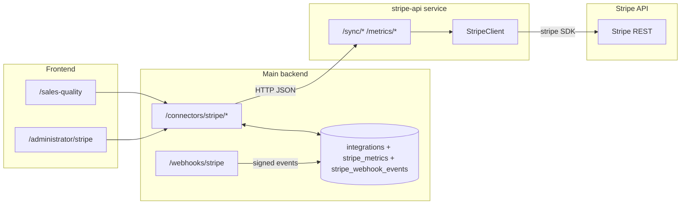

# Stripe integration

This document describes how the **ai-cfo** project talks to Stripe: service layout, request flow, which Stripe objects are used, and how amounts and Connect accounts are handled.

## Architecture overview

Stripe is **not** called directly from the main backend. A small **FastAPI microservice** (`stripe-api/`) owns the official Stripe Python SDK and exposes HTTP endpoints. The **main backend** (`backend/`) stores per-company credentials, forwards JSON to the microservice, and (for some metrics) persists snapshots in Postgres.



- **Docker**: `stripe-api` listens on container port `8002`, mapped to host `8102` in `docker-compose.yml`.
- **Backend config**: `STRIPE_API_BASE` (default `http://stripe-api:8002` in Docker; `http://127.0.0.1:8102` for local dev in `backend/.env.example`).

## Credentials and Connect

Per company, Stripe settings live in `integrations` with `type = Stripe`. The JSON `credentials` object may contain:

| Field | Purpose |
| --- | --- |
| `secret_key` | Stripe secret API key used for server-side calls. If omitted in the request body, `stripe-api` falls back to env `STRIPE_SECRET_KEY`. |
| `publishable_key` | Optional; forwarded for completeness but not required by current sync logic. |
| `stripe_account` | Optional **Connect** connected account id (e.g. `acct_...`). When set, list/retrieve calls use Stripe’s **Stripe-Account** header behavior via the SDK’s `stripe_account` parameter. |

The microservice builds a `StripeClient(api_key, stripe_account)` and passes `stripe_account` on every paginated `list` and on `Charge.retrieve` / `Customer.retrieve` when applicable.

**Security note:** Secret keys are stored in the integration `credentials` JSON like other simple connectors in this repo. They are not encrypted the same way as Wise OAuth tokens. Restrict database access and use restricted Stripe API keys where possible.

## stripe-api service

### API key resolution

```13:17:stripe-api/app/main.py
def _stripe_client(payload: StripeSyncRequest) -> StripeClient:
    api_key = payload.secret_key or os.getenv("STRIPE_SECRET_KEY")
    if not api_key:
        raise HTTPException(status_code=500, detail="STRIPE_SECRET_KEY not configured.")
    return StripeClient(api_key, payload.stripe_account)
```

### Endpoints

| Method | Path | Behavior |
| --- | --- | --- |
| `GET` | `/health` | Liveness. |
| `POST` | `/sync/revenue` | Revenue lines for the configured date window (see below). |
| `POST` | `/sync/balance-payouts` | Balance transaction ledger + payouts in parallel threads. |
| `POST` | `/metrics/true-net-margin` | Balance transactions enriched for margin KPIs. |

### Request body (`StripeSyncRequest`)

Defined in `stripe-api/app/schemas.py`: optional `stripe_account`, `publishable_key`, `secret_key`, `start_date`, `end_date`, `limit`.

Date window logic (`StripeClient._date_range`):

- If **both** `start_date` and `end_date` are omitted, the window is **`end = now`** and **`start = end - default_days`** (`30` for revenue, `7` for balance/payouts and true net margin).
- If only one bound is set, the other is derived the same way from `default_days`.
- Timestamps are UTC day boundaries (start of day / end of day).

### Pagination

`_list_all` walks Stripe list cursors (`starting_after`) until `has_more` is false, so responses can be large for busy accounts.

### Amounts and currencies

Stripe returns integer amounts in the smallest currency unit (e.g. cents). `StripeClient` converts to **major units** (float) using `_to_major`, with a fixed set of **zero-decimal** currencies (JPY, KRW, etc.) where no division by 100 is applied.

FX: when a balance transaction has a different `source_currency`, a short note is appended to descriptions (e.g. `FX EUR->USD @ …`).

## What each sync pulls from Stripe

### Revenue (`/sync/revenue`)

Default window: **30 days** (unless `start_date` / `end_date` are supplied; the main backend’s `sync-revenue` route currently does **not** pass dates, so the microservice always uses the default window).

For that window, the client aggregates three sources into a single flat list of `RevenueItem`:

1. **`BalanceTransaction.list`** — gross, fee, net, status, description/type, currency; FX note on description when relevant.
2. **`Charge.list`** with `expand=data.balance_transaction` — gross from charge, fee/net from expanded balance transaction when present; optional tax line in description; FX note when relevant.
3. **`Refund.list`** with `expand=data.balance_transaction` — negative amounts when balance transaction exists; otherwise simplified refund amounts.

So “revenue sync” is **ledger + charges + refunds**, not charges alone.

### Balance and payouts (`/sync/balance-payouts`)

Runs **in parallel** (`asyncio.gather` + `asyncio.to_thread`):

1. **`BalanceTransaction.list`** → `BalanceHistoryItem` (id, amounts, type, source id, description).
2. **`Payout.list`** → `PayoutItem` (amount, status, arrival, method, type).

Default window: **7 days** unless dates are provided (the admin UI sends a date range).

### True net margin (`/metrics/true-net-margin`)

1. Iterates **`BalanceTransaction.list`** in the date window with page `limit` from `request.limit` or **100**.
2. For each row: `gross`, `fee`, `net`, `margin_pct = (net/gross)*100` when `gross > 0`.
3. If `type == "charge"` and `source` is set: **`Charge.retrieve`** for payment amount and tax; **`Customer.retrieve`** if `charge.customer` exists, to attach `customer_metadata`.

## Main backend (`/connectors/stripe/*`)

All routes require **`Founder` or `Finance`** roles unless noted otherwise.

| Route | Role | Action |
| --- | --- | --- |
| `GET /connectors/stripe/settings` | Founder, Finance | Returns `stripe_account`, booleans `has_publishable_key`, `has_secret_key` (never returns raw keys). |
| `POST /connectors/stripe/settings` | Founder, Finance | Merges optional `stripe_account`, `publishable_key`, `secret_key` into integration credentials; marks connected when a secret key is present. |
| `POST /connectors/stripe/sync-revenue` | Founder, Finance | POSTs credentials JSON to `{STRIPE_API_BASE}/sync/revenue` (no date range), updates `last_sync_at`, returns microservice JSON. |
| `POST /connectors/stripe/balance-payouts` | Founder, Finance | Forwards `start_date`, `end_date` to `/sync/balance-payouts`. |
| `POST /connectors/stripe/metrics/true-net-margin` | Founder, Finance | Forwards date range + `limit` to `/metrics/true-net-margin`. |
| `POST /connectors/stripe/metrics/true-net-margin/store` | Founder, Finance | Same fetch as above, then **bulk inserts** each item as `stripe_metrics` row (`metric_type = "true_net_margin"`, `payload = item`). |
| `GET /connectors/stripe/metrics/true-net-margin` | Founder, Finance | Reads **stored** metrics from DB (`stripe_metrics`), optional `start_date` / `end_date` on **`created_at`** (ingestion time), not Stripe transaction time. |
| `DELETE /connectors/stripe/metrics/true-net-margin` | Founder, Finance | Deletes stored rows in optional `created_at` range. |

## Webhooks (main backend, no auth)

Stripe sends signed events to the **main API** (port 8000), not `stripe-api`. Configure the Dashboard endpoint to `https://<host>/webhooks/stripe` with the same signing secret as `STRIPE_WEBHOOK_SECRET`.

| Route | Purpose |
| --- | --- |
| `POST /webhooks/stripe` | Verifies `Stripe-Signature` with `stripe.Webhook.construct_event` (tolerance 300s). Persists each event id once in `stripe_webhook_events`. For `balance.*`, `payout.*`, `charge.*`, and `refund.*`, enqueues Celery `stripe_webhook_incremental_sync` to refresh True Net Margin for the last **3 days** (deduped by Stripe balance-txn `id` in `stripe_metrics`). |
| `POST /webhooks/stripe/mock` | **Dev / QA only.** Requires header `X-Mock-Stripe-Secret` equal to `MOCK_STRIPE_WEBHOOK_SECRET`. Body: `{ "company_id": <int>, "scenario": "payout.paid" \| "refund.created" \| "charge.failed" }`. `company_id` must exist in `companies` (e.g. after `scripts/seed_demo.py`); otherwise **404** with `Company id N not found`. Injects a synthetic Stripe-shaped event (`evt_mock_…`) and runs the same persist + incremental path (synthetic rows map to one `true_net_margin` metric line each). |

**Company routing**

1. `event["account"]` matched to `integrations.credentials["stripe_account"]` (Connect).
2. Else `data.object.metadata["aicfo_company_id"]` (string int) — used by mock payloads.
3. Else `STRIPE_WEBHOOK_DEFAULT_COMPANY_ID` (optional single-tenant fallback).

Unrouted events return **200** `{ "received": true, "ignored": "no_company" }` so Stripe does not disable the endpoint.

## Frontend usage

- **Administrator → Stripe** (`frontend/src/app/administrator/stripe/page.tsx`): load/save settings, trigger revenue sync, balance/payout fetch with CSV download.
- **Sales Quality** (`frontend/src/app/sales-quality/page.tsx`): loads stored true net margin via `GET /connectors/stripe/metrics/true-net-margin?start_date=…&end_date=…` for charts/KPIs.

## Environment variables

| Variable | Where | Purpose |
| --- | --- | --- |
| `STRIPE_SECRET_KEY` | `stripe-api/.env` | Default secret key when the request body does not include `secret_key`. |
| `STRIPE_PUBLISHABLE_KEY` | `stripe-api/.env` (optional) | Documented in README; not required by current server logic. |
| `STRIPE_API_BASE` | `backend` | Base URL of the stripe-api service. |
| `STRIPE_WEBHOOK_SECRET` | `backend` | Stripe Dashboard webhook signing secret (`whsec_…`) for `POST /webhooks/stripe`. |
| `STRIPE_WEBHOOK_DEFAULT_COMPANY_ID` | `backend` (optional) | When Connect `account` and metadata routing both miss, associate events with this company id. |
| `MOCK_STRIPE_WEBHOOK_SECRET` | `backend` (optional) | Shared secret for `POST /webhooks/stripe/mock`; if unset, mock route returns 404. |

## Operational notes

- **Timeouts:** Backend uses `requests` with **60s** timeout to the microservice; heavy accounts may need tuning or narrower date ranges.
- **Errors:** Upstream Stripe or network failures surface as **502** from the main backend with the microservice error text when available.
- **SDK version:** `stripe==9.12.0` in `stripe-api/requirements.txt` and `backend/requirements.txt` (webhook signature verification on the main API).

## Related files

- Microservice: `stripe-api/app/main.py`, `stripe-api/app/stripe_cl.py`, `stripe-api/app/schemas.py`
- Backend proxy: `backend/app/api/connectors.py`
- Models: `backend/app/models/models.py` (`IntegrationType.stripe`, `StripeMetric`, `StripeWebhookEvent`)
- Migrations: `0015_integration_type_stripe.py`, `0016_stripe_metrics.py`, `0018_stripe_webhook_events.py`
- Webhooks: `backend/app/api/webhooks.py`, `backend/app/services/stripe_webhook_incremental.py`, `backend/app/worker.py` (`stripe_webhook_incremental_sync`)
